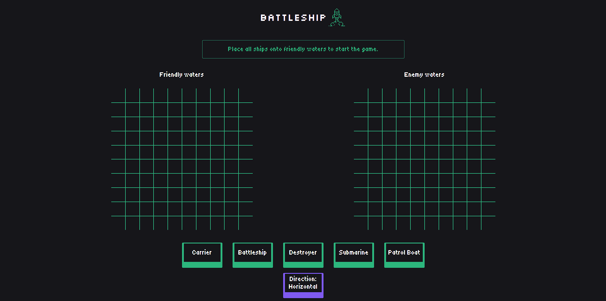

# Battleship

The classic game of battleship, implemented using HTML, CSS, JavaScript, webpack and Jest testing framework, showcasing the power of test-driven development.

Check it out :point_right:[here!](https://mell62.github.io/battleship/):point_left:

## :joystick: Features

- Select desired ship and hover and click over friendly board to place it; option to rotate ship is available by clicking on direction button
- Ships cannot be placed adjacent to each other
- Turn-based attack mechanism: When the player makes an attack, the game enters a waiting period until computer finishes its attack.

## :tada: Achievements

- **Webpack** is utilized for the bundling of code of multiple files through ES6 Modules and minification
- **Jest** testing framework is used for unit testing game logic, ensuring integrity and bug-resistant code
- **Test-driven-development** principles practised through Jest, ensuring high-quality code

## :grey_exclamation: Limitations

- Tests not implemented for UI integration
- Player vs player not implemented

## :magic_wand: Extras!

- Realistic intelligence implemented for computer attacks
- Appropriate icons and game messages is displayed for each type of attack

## :page_with_curl: Note

- Modern normalize is used for cross-browser consistency
- ESLint is used for code analysis
- Babel is used to transpile code for compatibility with older browsers
